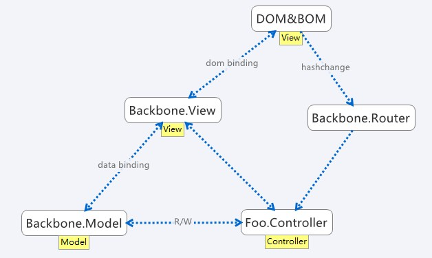
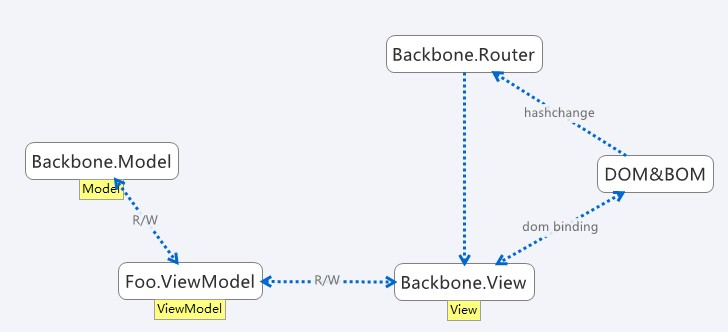

昨夜开始实现[利用github api 把文章评论丢到Issue里面](/2013/05/hello/)，选型时选择了Backbone作为基础，对比以往研究过的其他各类框架，Backbone是崭新而让我震惊的

先说结论：Backbone是_framework of MV\* frameworks_，是框架的框架；或者说，Backbone仅仅抽象了web app framework中多数都需要的功能组织成api接口，但并没有将自己限制在任何一种风格，而是要求开发者先以Backbone为基础自己定义出一种框架（完成MV\*中“\*”部分和V部分的定义），然后再实现自己的业务。

### 不是MVC, MVP, MVVM
<!--more-->

MV\*家族的差异在于\*，也就是Model和View的中间代码，中间代码的职责、边界、执行方式输入输出等决定了MV\*框架的类别，Backbone不存在这样的中间层。

[Wikipedia](http://enwp.org/Backbone.js)和很多其他人将Backbone定义为MVP，我觉得这可能是因为相对而言将Backbone完善为一个MVP框架是成本比较低的，但即使同样的MVP模式，Backbone也可以展现出截然不同的组织结构来！

其实官网简介正暗示了这个结论：
>Backbone.js gives structure to web applications by providing models with key-value binding and custom events, collections with a rich API of enumerable functions, views with declarative event handling, and connects it all to your existing API over a RESTful JSON interface.

Backbone并没有定死如何连接model和view，没有定死app的结构究竟如何，而只是抽象了model和view，甚至`Backbone.View`不一定做MV\*中的V部分。

### Backbone Storm
几分钟的简单brainstorm就让我列出了非常多种以Backbone为基础的结构

将`Backbone.View`作为MVP模式中的P，V层只留原生DOM/BOM。而`Backbone.Router`仅作为处理HistoryAPI/Hashchange的辅助。这种结构中M、V、P三者都有很好的事件支持，比较适合事件驱动的开发思路，但估计模块化、拆分View可能有难度

同样MVP结构，也可以边缘化`Backbone.View`，将其仅作为绑定dom的辅助，而将`Backbone.Router`作为MVP模式中的P。Router为核心的好处是如果单页面状态多的时候会比较轻松，另外`Backbone.View`被边缘化后，可能会有利于动态切换、嵌套、拆分。而Router本身由于本身逻辑主要是分发，天然来说不难拆分。

虽然`Backbone.Router`曾经被称为Controller，但在非单页的webapp中这并不合适，额外单独的Controller可能适用范围更广一点。这种结构中`Backbone.View`作为View的一部分，主要负责屏蔽DOM/BOM的细节，Controller负责交互逻辑，比起之前的MVP显得更灵活一些（`Backbone.View`瘦意味着易于移植到不同终端）

在MVVM模式中，VM负责将领域模型Model和视图View对接，以Backbone为基础来看，VM可以直接继承`Backbone.Model`，然后在`sync`方法中对接实际的领域Model，也可以直接手写。无论如何，`Backbone.View`作为View来屏蔽dom细节应该是没有问题的。注意这种结构下Model需要经历两个类才最终影响到Dom结构，层数多往往同时意味着复杂性和灵活性。感觉可能会比较难以把握VM和M之间的边界。

### 除了*部分，我们还要担心什么？
+ 操作DOM的方式：虽然`Backbone.View`相关代码中有亲jQuery的部分，但同样也有render方法来承载模板引擎的渲染工作；或者用继承的事件机制来完成一个数据绑定到dom的关系似乎也并不突兀。至少我能想象到的三种dom操作风格，Backbone都能很好的承载。
+ 嵌套
  + 嵌套Model。通过覆盖initialize、sync等方法不难实现，更复杂的关联关系也基本和其他语言/框架类似处理即可。当然选用插件也是个不错的主义。
  + 嵌套View。由于不同的组织方式对View的职责、边界的定义并不一样，所以如果你有类似的需求，最好将嵌套View的方式最开始就考虑进你的设计中。另外，注意如果嵌套View的同时DOM元素也嵌套的话，小心处理事件冒泡。
  + 嵌套Router。如果单纯只做纯分发，一般问题不大，但如果同时要在Router里面写逻辑，那分Router嵌套Router就是必须要考虑的了

### 总结
其实MV\*家族纠结的不外乎纯领域的Model和纯前端的View之间的这些代码如何组织，哪些可以侵入进入Model哪些可以侵入View；总体思路其实都是解耦。那么其实如何解耦的原则也很简单：越有可能变化的地方越要解耦、抽象，而不容易变化的地方则可以接受一定程度的耦合来为其他（效率、代码量、系统复杂度）妥协。

Backbone将各类框架中有多种流派的、没有标准答案的部分忽略，只实现最基础、公认的最佳实践，将决定权交还了开发者，由开发者决定究竟使用何种风格；正如官网上宣称的[There's More Than One Way To Do It](http://backbonejs.org/#FAQ-tim-toady)，Backbone就是这样一个自由的，不完整的，框架之框架

---

参考    

+ <http://backbonejs.org/>
+ <http://lostechies.com/derickbailey/2011/12/23/backbone-js-is-not-an-mvc-framework/>
+ <http://geekswithblogs.net/dlussier/archive/2009/11/21/136454.aspx>
+ <http://www.codeproject.com/Articles/228214/Understanding-Basics-of-UI-Design-Pattern-MVC-MVP>

--EOF--

