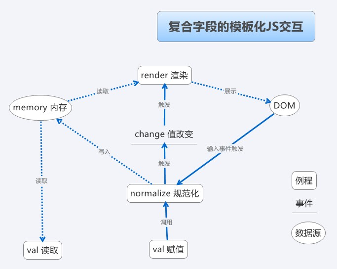

## 组织大表单应用中javascript代码的一种方法

### 问题，动机，目的

超过一屏，属性复杂到一定程度的录入界面/系统中，缺乏良好架构的javascript代码往往容易失控。尤其是当规模从小型表单开始逐渐变大时，javascript代码很容易演变成已DOM为核心的、缺乏结构、满是hack且难以维护的状态。

我认为良好可维护的JS代码应该具有以下的特性

+ 单个文件应该控制在一千行以内
+ 依赖管理和合并，开发应该单看一个JS文件就知道它依赖别的哪些代码，而不是在HTML中直接列举所有依赖，或者更糟，把所有超过2个页面要用的JS全写一起。
+ 良好的代码复用，清晰的模块划分
+ 改变字段的表现形式或逻辑时，不应该需要修改/考虑/知道其他字段的逻辑和展现形式。改变DOM树结构、更换表单控件等改变展现方式的需求不应当对JS产生毁灭性打击。

前三个问题基本可以归结为，超过一千行的或是需要复用的JS代码使用RequireJS / SeaJS 等方案进行分解和管理。由于这是复杂JS工程的共性，这里不多做展开讨论。本文主要关注最后一点，也就是如何解除字段逻辑和展示之间的耦合，如何解除字段和其他字段的耦合。

<!--more-->
### 解耦，协议，模板化

解除耦合的做法不外乎将抽象出最小化的接口（协议）。字段可以有千奇百怪的各种逻辑，但抽象后发现其实针对单个字段来说，需要的最小接口非常小——简直太适合解耦、正交化了

+ `val` 方法，传值则写入，不传则读取（jQuery风格）
+ `setReadonly` 方法 设置只读
+ `setWritable` 方法 设为可写（当然设计成`setReadonly(false)`也不坏）
+ `change` 事件 值被改变时触发
+ `error` 事件 需要提示用户这个字段有问题时触发

订好接口以后，每个字段只需要自己都实现接口，除了每个字段自己的实现代码之外，外部一律通过接口来和字段交互。这样代码就整体可控可维护，扩展性和可读性都能令人满意。

有了这样的接口，我们的逻辑实现就可以非常语义化，比如折扣锁定为=现价/原价

```js
good.discount.setReadonly();
var discountUpdate = function() {
    good.discount.val(good.price.val() / good.originalPrice.val());
};
good.price.addListener('change', discountUpdate); //注意：这不是DOM事件
good.originalPrice.addListener('change', discountUpdate);
```

这样一段代码完全不涉及dom交互，所以无论价格如何输入展示，折扣如何展示都没有问题。而实现dom交互的代码也完全不必关心这个字段的逻辑如何，只需要实现前述接口，将输入输出、只读、提示信息这些行为和DOM绑定即可。

最常用也是最多的绑定就是一个字段对应一个DOM控件，这种绑定只需要简单地将DOM事件转发成自定义事件，将读写转换成DOM控件读写即可；稍微复杂一些的交互涉及富文本编辑、日历控件等输入形式，由于我们的接口非常小，所以一般也无需太多的代码。

问题往往来源于更复杂的一些字段，他们在持久化时往往体现成JSON/XML格式字符串，或者是额外的扩展表。这些字段往往无法轻易地用一个标准DOM控件来表现，也往往是混乱的来源。

DOM操作难以维护的主要原因是插入、删除元素的同时还要维护事件，在同一个页面反复进行各种操作的时候，逻辑容易有问题，所以我的做法是

+ 事件用委托仅在初始化的时候绑在容器上一次
+ 不单独插入、删除dom元素，而是以模板和数据渲染出所有元素
+ 在内存里维护一个变量存储当前的数据，dom里面的数据并不具权威性



+ render渲染例程：
    * 触发点：由change事件触发
    * 行为：从内存读取数据后（用模板）渲染出所有的DOM元素的HTML代码，一次性吐在容器中
+ normalize规范化例程：
    * 触发点：dom事件/val赋值 写入数据时
    * 行为：将输入数据进行规范化，然后写入内存并触发change事件

### 校验，提交

由于复杂表单往往涉及同样复杂的验证逻辑，建议尽可能将逻辑集中在后台CGI，JS少做逻辑（否则同时维护两套不同语言的等价的逻辑成本较大）

无论错误是从CGI拿到，还是JS自己验出来，显示错误提示都一样通过字段上的`error`事件来传递，校验代码负责触发事件，字段本身的实现代码监听事件来在界面上显示相应的提示。

提交数据时，只需要遍历所有字段的集合，将他们的字段名和`val()`结果拼装

### DSL

总而言之，解决混乱代码的思路之一是将“需求/规则”和“表现/操作”分离，将前者抽象成某种形态的DSL，使之尽量贴近产品的需求，然后将后者作为这种DSL的解释器来写。代码写到像自然语言就赢了。如果做不到，不妨针对一个领域写解释器来解释为什么这些自然语言能工作。这是符合计算机科学发展大规律的，__道法自然__。

--EOF--


