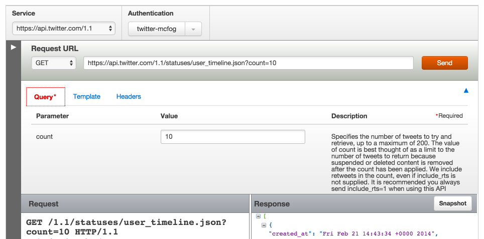
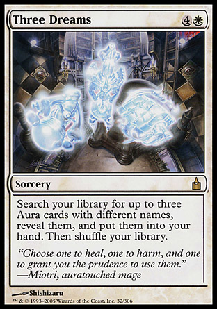

### Prologue  

在写API的过程中有这样三种产物

+ 文档

  几乎没人爱写文档，写了也懒得维护。可是同时API的文档对于其他程序员来说又是赖以生存的必需品。因此大家对文档都是爱恨交加，恨自己要维护文档，爱别人写好的漂亮文档；恨别人的烂文档错文档，爱自己随便乱写乃至不写文档。

+ 操场

  比文档更高一个层次的奢侈品，不用写代码简单点点或者repl形式马上就能探索接口的行为。不像仅对别人，操场的存在对自己开发接口也是很有帮助的。

  没操场的时候，大家往往人肉建一个文件当操场用，在里面各种玩API，但使着编译型语言的兄弟们没那么好运，他们更需要有操场。

  当然如果实践TDD或BDD的话，用例大概能代替操场一部分的作用，但这只对写接口的人管用。对调用接口的人来说，操场的作用是难以取代的。

+ 字段校验逻辑

  自己写接口的时候必须要做的事情。没做那是100%bug。


想想这三个产物的共同特点是什么？插入一段广告，哦不，我先把他们捏成一张表

<!--more-->

|          | 别人的接口     | 自己的接口   |
|----------|----------------|--------------|
| 文档     | 没有会死       | 没用，不想写 |
| 操场     | 超级提升幸福感 | 想用，懒得写 |
| 字段校验 | 不太关心       | 必须写       |

他们的共同特点是**均源自接口输入的schema**

大家为啥不喜欢写文档？为啥懒得实现操场？我觉得很可能源自_程序员的直觉_。程序员天生讨厌重复，他们知道重复意味着修改的时候要同步维护，意味着大量重复的劳动和不同步带来的各种巨坑，**Duplicate Is Evil**。**DUPLICATE IS EVIL**

换个角度说，怎么诱使程序员乖乖地写文档呢？首先利诱“写文档的话送你个操场玩玩”，然后威逼“反正你也得校验字段，咱们校验字段的方式就是写文档”，最后再给个枣子“这文档不用维护，以后改程序的同时文档自动一起改”

前言到此为止，结论只有一个：

> 我们要让文档、操场、字段校验三位一体！让不写文档比写文档难！让所有接口都有100%准确的文档和操场！消灭天下没文档的接口！消灭一切和实际接口不符的文档！



具体实现的思路其实刚才已经偷偷提到了，那就是聚焦接口的__输入schema__，以schema作为数据源，文档、操场、字段校验是schema的3种不同的应用。所以我们要构建的就是 a)meta-schema，即如何定义schema b)如何通过schema生成3种不同的产物。

### Meta-Schema

程序员做事大体上有两种选择：找现成的轮子削成方的来用或自己造个方的轮子。我们想要的轮子“方”在哪里呢？嗯，schema大家都拿来做校验，但我们希望不仅能校验，还能生成文档和操场，也就是说希望它能够内嵌一些描述文字，最好校验规则也能轻松转换成文字展示。

自己造轮子的话，下面是一个基本的结构可以参考

```
class Schema {
    string uri;//接口位置/调用时的名称/url等
    string name;//接口中文名
    string desc;//说明
    array fields;//接口字段
}

class Field {
    string key;//字段key
    string desc;//说明
    bool required;//是否必填
    array constraints;//字段约束
}

class Constraint {
    bool check(value);//校验
    string describe();//描述
}

//Constraint常见的子类有：类型校验，长度／范围校验，正则校验等
```


找轮子的话，我用过[json-schema](http://json-schema.org/)做这一块，能用，很多语言都有校验的实现，还有类似[json-editor](https://github.com/jdorn/json-editor)这样的web editor实现，操场比较好搞。大体上能内嵌说明文字，各种语言都有良好实现，数据结构清晰容易导入导出的schema项目都可以用。

### DSL for Meta-Schema

> “好麻烦，我还是if if if吧”

只有schema还不够，你会需要负责教会所有同事一门新手艺，这可能将我们的努力毁于一旦，自己用起来也不爽。我们要的是DSL，要IDE的代码提示，要code-as-configuration。

怎么实现DSL超出本文范围，有机会我会再写这方面的东西，js的话大概[300行代码](https://github.com/mcfog/legate/tree/a87ecc367b297643e299f1ce4d6685fbbd0444df/lib)就能实现类似这样的dsl了

```js
    legate().define
        .name('测试接口')
        .desc('演示API用的测试接口')
        .cmd('test')
        .param
            .int('num', '一个数字', [3, 100])
            .string('str', '字符串', [2, 5])
            .regex('reg', '有追求的字符串', /a.+b/)
        .endParam
        .logic(function(param) {
            return {
                result: 'from remote',
                param: param
            };
        })
    .endDefine
    .mount(legateServer);
```

有了DSL，基本上已经可以宣告**不写文档比写文档难**了，下面要给按我们的meta-schema做事的乖孩子说好的三大产物。

### 显灵

其实原本写到这里就可以收笔了，因为定义好了数据结构，写写视图对程序员来说实在没啥挑战，不是么？

文档就是
```
loop schemas schema
  show schema
  loop schema.fields field
    show field
```

操场就是文档套上
```html
<form target="result">
</form>
<iframe id="result">
```

校验就是
```
loop schema.fields field
  if no $data[field]
    if field.required
      BIG-BANG!
    else
      continue

  loop field.constraints constraint
    constraint.check $data[field]
```

啊，不小心还顺便实现了分发或者说路由呢
```
loop schemas schema
  if $request match schema.uri
    return run schema, $request

NOT-FOUND!
```

是不是根本停不下来？

另一个好消息是，这个思路下各种其他开源项目都很容易拿过来套上，比如之前提过的[json-schema](http://json-schema.org/)和[json-editor](https://github.com/jdorn/json-editor)，比如最近的[swagger.io](http://petstore.swagger.wordnik.com/#!/pet/addPet)等等，只要把握住核心是schema，操场／文档／校验逻辑等都是schema的视图，世界便尽在我们的掌握之中。


附《The Pragmatic Programmer》中的相关tips

> [11] Don't Repeat Yourself  
> [12] Make It Easy to Reuse  
> [17] Program Close to the Problem domain  
> [68] Build Documentation In, Don't Bolt It On  